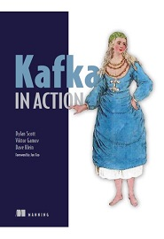
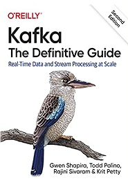

= Apache Kafka Notes
:toc: right
:source-highlighter: coderay

Kafka Docs::
https://kafka.apache.org/documentation/#gettingStarted

== Shutting Down Producer 

When you're running a Java application in an endless loop and you want to ensure proper shutdown even when the application is interrupted (e.g., by pressing `Ctrl+C`), you can use a shutdown hook to handle the cleanup and disconnection process. Here's how you can modify the previous example to achieve this:

```java
import org.apache.kafka.clients.producer.*;
import java.util.Properties;

public class KafkaProducerExample {

    private static KafkaProducer<String, String> producer;

    public static void main(String[] args) {
        // Kafka broker address and port
        String bootstrapServers = "localhost:9092";

        // Topic to publish messages to
        String topic = "test-topic";

        // Create Kafka Producer properties
        Properties properties = new Properties();
        properties.setProperty(ProducerConfig.BOOTSTRAP_SERVERS_CONFIG, bootstrapServers);
        properties.setProperty(ProducerConfig.KEY_SERIALIZER_CLASS_CONFIG, "org.apache.kafka.common.serialization.StringSerializer");
        properties.setProperty(ProducerConfig.VALUE_SERIALIZER_CLASS_CONFIG, "org.apache.kafka.common.serialization.StringSerializer");

        // Create Kafka Producer
        producer = new KafkaProducer<>(properties);

        // Add shutdown hook to close producer properly
        Runtime.getRuntime().addShutdownHook(new Thread(() -> {
            System.out.println("Shutting down...");
            producer.close();
            System.out.println("Producer closed.");
        }));

        // Infinite loop to send messages
        while (true) {
            String message = "Hello, Kafka!";
            ProducerRecord<String, String> record = new ProducerRecord<>(topic, message);
            producer.send(record, (metadata, exception) -> {
                if (exception == null) {
                    System.out.println("Message sent successfully - Offset: " + metadata.offset());
                } else {
                    System.err.println("Error sending message: " + exception.getMessage());
                }
            });
            try {
                Thread.sleep(1000); // Wait for 1 second
            } catch (InterruptedException e) {
                Thread.currentThread().interrupt();
            }
        }
    }
}
```

In this version of the code, a shutdown hook is added using the `Runtime.getRuntime().addShutdownHook()` method. This hook will be executed when the application receives an interrupt signal, such as when you press `Ctrl+C`. The hook ensures that the Kafka producer is properly closed before the application exits, allowing for a clean shutdown even in the midst of producing messages in a loop.

Remember that even with this approach, it's a good idea to handle exceptions and edge cases properly to ensure robustness and reliability in your application.


== Kafka in Action



GitHub - Kafka in Action - Source Code::
https://github.com/Kafka-In-Action-Book/Kafka-In-Action-Source-Code

Kafka Java Client from Confluent::
https://docs.confluent.io/kafka-clients/java/current/overview.html

== Kafka: The Definitive Guide

